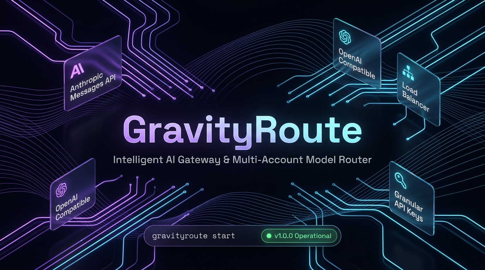

# GravityRoute

[](https://github.com/samoba-islam/gravityroute/releases)
[](LICENSE)
[](https://nodejs.org/)
[](https://github.com/samoba-islam/gravityroute)

**GravityRoute** is a high-performance AI proxy gateway, multi-account load balancer, and model router. It exposes standard **Anthropic Messages API** (`/v1/messages`) and **OpenAI Chat Completions** (`/v1/chat/completions`) endpoints backed by intelligent multi-account Google pooling, custom AI provider integration, granular API key governance, and a real-time dark glassmorphic Web Management Console.

Seamlessly connect with **Claude Code CLI**, **Cursor**, **Continue.dev**, **OpenClaw / ClawdBot**, and official **OpenAI / Anthropic SDKs (Python, Node.js, Go)**.



> **⚠️ Terms of Service & Disclaimer:** This project is an independent gateway not affiliated with Google LLC or Anthropic PBC. Please review [Safety, Usage & Risk Notices](docs/safety-notices.md) and [Legal Documentation](docs/legal.md) prior to production deployment.

---

## 🌟 Key Capabilities

### ⚡ Intelligent Gateway & Multi-Model Routing
- **Dual Standard Protocol Compatibility**: First-class support for `/v1/messages` (Anthropic) and `/v1/chat/completions` (OpenAI).
- **Extended Thinking & Reasoning Block Preservation**: Preserves thought chains and reasoning signatures across Claude and Gemini thinking models with full SSE streaming support.
- **Dynamic Model Mapping**: Alias, redirect, pin, or hide models directly from the WebUI without restarting the server.

### 🔄 Multi-Account Load Balancing & Auto-Failover
- **Smart Rotation Strategies**: Choose between **Hybrid** (smart distribution), **Sticky** (optimized for prompt caching), **Round-Robin**, or **Quota-Aware** routing.
- **Proactive Quota Protection**: Configurable per-account and per-model quota thresholds to switch accounts gracefully *before* hitting upstream rate limits.
- **Automated Health Monitoring**: Real-time health checks, error backoff, and direct one-click verification links for accounts requiring attention.
- **Account Pool Export & Migration**: Securely export and import account pools as encrypted/validated JSON.

### 🌐 Custom Upstream Providers (OpenAI & Anthropic Compatible)
- **Universal Provider Integration**: Plug in third-party providers (DeepSeek, Groq, Ollama, OpenRouter, Together AI, vLLM, etc.).
- **Per-Provider Governance**: Set model mappings, lifetime/monthly token quotas, and financial spend caps.
- **Built-in Connectivity Tester**: Verify upstream endpoints and response latencies directly in the WebUI.

### 🔑 Granular API Key Management
- **Proxy Client Keys**: Issue unique `gr-...` API keys for client applications, developers, or microservices.
- **Per-Key Model Restrictions**: Whitelist strictly allowed models per key, preventing unauthorized or high-cost model calls.
- **Token Quotas & Expiration**: Enforce hard or soft monthly/lifetime token usage limits.
- **IP Address Whitelisting**: Restrict key usage to specific CIDR ranges or individual IP addresses.

### 🖥️ Real-Time Web Management Console
- **Glassmorphic Cyber-Dark Interface**: Built with Tailwind CSS and Alpine.js for zero bloat, blazing fast rendering, and maximum responsiveness.
- **Live Metrics & Quota Meters**: Monitor real-time request rates, token throughput, model health, and 30-day historical trends.
- **Live Log Streamer**: Real-time console log tailing with severity filters (Info, Warn, Error, Debug) and instant keyword search.
- **Multi-Language Localization**: Full translation across English (🇺🇸), Bengali (🇧🇩), Chinese (🇨🇳), Turkish (🇹🇷), Indonesian (🇮🇩), and Brazilian Portuguese (🇧🇷).

### 🔒 Enterprise Security & Password Recovery
- **WebUI Authentication**: Protect management access with configurable admin credentials and secure session tokens.
- **Dual Password Recovery**:
  - **CLI Reset**: Instantly reset admin credentials via local terminal (`gravityroute reset-password <new_pass>`).
  - **Email OTP via SMTP**: Deliver a 15-minute 6-digit cryptographic verification code to the administrator email address.

---

## 🏗️ Architecture Overview

```
┌────────────────────────────────────────────────────────────────────────┐
│                        Client Applications                             │
│    Claude Code CLI  •  Cursor  •  OpenClaw  •  OpenAI / Anthropic SDKs │
└────────────────────────────────────────────────────────────────────────┘
                                    │
                                    ▼ (HTTP / SSE Streaming)
┌────────────────────────────────────────────────────────────────────────┐
│                        GravityRoute Proxy                              │
│                                                                        │
│   ┌─────────────────────┐  ┌─────────────────────┐  ┌───────────────┐  │
│   │ API Key Validator   │  │ Model Router / Alias│  │ IP Whitelist  │  │
│   └─────────────────────┘  └─────────────────────┘  └───────────────┘  │
│   ┌─────────────────────────────────────────────────────────────────┐  │
│   │ Load Balancer: Hybrid • Sticky (Prompt Caching) • Round-Robin   │  │
│   └─────────────────────────────────────────────────────────────────┘  │
│   ┌─────────────────────────────────────────────────────────────────┐  │
│   │ Transform Engine: Anthropic Messages ⮂ Google Generative AI /   │  │
│   │ OpenAI Chat Completions ⮂ Custom Upstream Formats               │  │
│   └─────────────────────────────────────────────────────────────────┘  │
└────────────────────────────────────────────────────────────────────────┘
                     │                                   │
                     ▼                                   ▼
┌───────────────────────────────────────┐  ┌─────────────────────────────┐
│ Google Cloud Code / Gemini Upstream   │  │ Custom Upstream Providers   │
│ (Pooled OAuth Multi-Account System)   │  │ (DeepSeek, Groq, Ollama...) │
└───────────────────────────────────────┘  └─────────────────────────────┘
```

---

## 📦 Installation

### Option 1: One-Click Linux / Cloud VPS Setup (Automated)

Installs **Node.js 20 LTS** and build tools (if missing), sets up GravityRoute, and configures a **systemd service** so the proxy automatically starts on boot and restarts if interrupted:

```bash
curl -fsSL https://raw.githubusercontent.com/samoba-islam/gravityroute/main/install.sh | sudo bash
```

*Compatible with Ubuntu, Debian, CentOS, RHEL, Fedora, Rocky Linux, AlmaLinux, Arch, and Alpine.* See [Linux Service Documentation](docs/linux-service.md) for management details.

---

### Option 2: Global Install via npm

```bash
# Install globally
npm install -g gravityroute

# Start proxy in the background
gravityroute start
```

Or run without installing using `npx`:

```bash
npx gravityroute@latest start
```

*(CLI aliases `gravityRoute`, `acc`, and legacy `antigravity-claude-proxy` are also available for backward compatibility).*

---

### Option 3: Clone from GitHub

```bash
git clone https://github.com/samoba-islam/gravityroute.git
cd gravityroute
npm install
npm start
```


---

## 🚀 Quick Start

### 1. Control Commands

| Command | Action |
| :--- | :--- |
| `gravityroute start` | Launch proxy as a persistent background daemon on port `8080` |
| `gravityroute start --log` | Run in foreground with live console logs |
| `gravityroute stop` | Terminate running background daemon |
| `gravityroute restart` | Gracefully restart daemon |
| `gravityroute status` | View running PID, port, and health state |
| `gravityroute ui` | Open the Web Management Console in default browser |
| `gravityroute reset-password <new_pwd>` | Reset Web Console admin password from terminal |

To run on a custom port:
```bash
PORT=3001 gravityroute start
```

### 2. Configure Upstream Accounts

Open the Web Console at `http://localhost:8080`:

1. **OAuth Link**: Go to the **Accounts** tab and click **Add Account**. Complete the Google authorization in the browser popup.
2. **Headless / Remote Servers**: Click **Add Account** → switch to **Manual Authorization**, copy the authorization URL, authenticate in any browser, and paste the code back.
3. **Local Antigravity Integration**: If you have the Antigravity desktop app running, GravityRoute auto-detects and loads the active session automatically.

### 3. Verify Health

```bash
# Health check endpoint
curl http://localhost:8080/health

# Table view of active accounts and quota status
curl "http://localhost:8080/account-limits?format=table"
```

---

## 🛠️ Client Integrations

### 1. Claude Code CLI

#### Automated Setup (Via Web Console)
1. Open `http://localhost:8080/#settings/claude`.
2. Select your default model, sub-agent model, and routing mode.
3. Click **Apply to Claude CLI** to automatically update your configuration.

#### Manual Configuration
Add or update `~/.claude/settings.json` (macOS/Linux) or `%USERPROFILE%\.claude\settings.json` (Windows):

```json
{
  "env": {
    "ANTHROPIC_BASE_URL": "http://localhost:8080",
    "ANTHROPIC_MODEL": "claude-opus-4-6-thinking",
    "ANTHROPIC_DEFAULT_OPUS_MODEL": "claude-opus-4-6-thinking",
    "ANTHROPIC_DEFAULT_SONNET_MODEL": "claude-sonnet-4-6",
    "ANTHROPIC_DEFAULT_HAIKU_MODEL": "claude-sonnet-4-6",
    "CLAUDE_CODE_SUBAGENT_MODEL": "claude-sonnet-4-6",
    "ENABLE_EXPERIMENTAL_MCP_CLI": "true"
  }
}
```

Or set the environment variable in your terminal session:
```bash
export ANTHROPIC_BASE_URL="http://localhost:8080"
claude
```

---

### 2. OpenAI SDK (Python & Node.js)

GravityRoute provides a standard `/v1/chat/completions` endpoint.

#### Python:
```python
from openai import OpenAI

client = OpenAI(
    base_url="http://localhost:8080/v1",
    api_key="gr-your-api-key"  # or dummy value if API keys are not required
)

response = client.chat.completions.create(
    model="claude-sonnet-4-6",
    messages=[
        {"role": "system", "content": "You are a helpful coding assistant."},
        {"role": "user", "content": "Write a fast Fibonacci function in Rust."}
    ],
    stream=True
)

for chunk in response:
    content = chunk.choices[0].delta.content
    if content:
        print(content, end="", flush=True)
```

#### Node.js:
```javascript
import OpenAI from "openai";

const openai = new OpenAI({
  baseURL: "http://localhost:8080/v1",
  apiKey: "gr-your-api-key",
});

const response = await openai.chat.completions.create({
  model: "claude-sonnet-4-6",
  messages: [{ role: "user", content: "Explain quantum computing briefly." }],
});

console.log(response.choices[0].message.content);
```

---

### 3. Cursor & Continue.dev
- **Base URL**: `http://localhost:8080`
- **Model Provider**: Anthropic or OpenAI Compatible
- **API Key**: Enter your generated GravityRoute API Key (`gr-...`) or any placeholder string if keys are disabled.

---

## 📚 Detailed Documentation

| Guide | Description |
| :--- | :--- |
| [Linux Setup & Systemd Auto-Restart](docs/linux-service.md) | One-click Linux installer, auto-restart on reboot, and systemd management |
| [Web Management Console](docs/web-console.md) | Complete walkthrough of UI tabs, metrics, logs, and settings |
| [API Endpoints Reference](docs/api-endpoints.md) | Full endpoint catalog including `/api/keys`, `/api/providers/custom`, and auth |
| [Multi-Account Load Balancing](docs/load-balancing.md) | Strategy details (Hybrid, Sticky, Round-Robin) and quota failover logic |
| [Supported Models](docs/models.md) | Listing of supported Claude, Gemini, and thinking models |
| [Advanced Server Configuration](docs/configuration.md) | Presets, environment variables, timeout adjustments, and proxy modes |
| [OpenClaw / ClawdBot Integration](docs/openclaw.md) | Configuration guide for OpenClaw bot frameworks |
| [macOS Menu Bar Companion](docs/menubar-app.md) | Native menu bar tray companion for macOS users |
| [Testing & Quality Assurance](docs/testing.md) | Running test suites for thinking signatures, schema sanitizers, and token limits |
| [Troubleshooting & Diagnostics](docs/troubleshooting.md) | Resolving common errors, token expirations, and port collisions |
| [Developer Guide](docs/development.md) | Local Tailwind build system, scripts, and contribution workflow |
| [Safety & Risk Notices](docs/safety-notices.md) | Account safety best practices and rate limit recommendations |
| [Legal & Licensing](docs/legal.md) | Trademark notices, community grants, and commercial licensing guidelines |

---

## 👨‍💻 Author & Maintainer

**Shawon Hossain Samoba**  
- **Email**: [shawon.hossain.samoba.bd@gmail.com](mailto:shawon.hossain.samoba.bd@gmail.com)  
- **GitHub**: [@samoba-islam](https://github.com/samoba-islam)  
- **Repository**: [https://github.com/samoba-islam/gravityroute](https://github.com/samoba-islam/gravityroute)

### Historical Attribution
Portions of base proxy routing logic are derived from open-source foundations Copyright (c) 2024 Badri Narayanan S. Additional insights derived from `opencode-antigravity-auth` (NoeFabris) and `claude-code-proxy` (1rgs).

---

## 📜 License

This project is licensed under the **GravityRoute Community & Commercial License**.

### Free Community Grant:
- **Personal & Non-Commercial Use**: Free for personal, individual research, and educational purposes.
- **Small Teams**: Free for internal evaluation, development, and operations for teams or organizations with **up to a maximum of 5 members / active users**.

### Commercial License Required:
Any use:
1. Within or on behalf of an enterprise, company, business, or team exceeding **5 members**, OR
2. In commercial, industrial, or production hosting environments,

**REQUIRES A CUSTOM COMMERCIAL LICENSE** purchased from the copyright holder.

To inquire about or purchase a commercial license, please contact:  
**Shawon Hossain Samoba** (`shawon.hossain.samoba.bd@gmail.com`)  
See full details in the [LICENSE](LICENSE) file.

