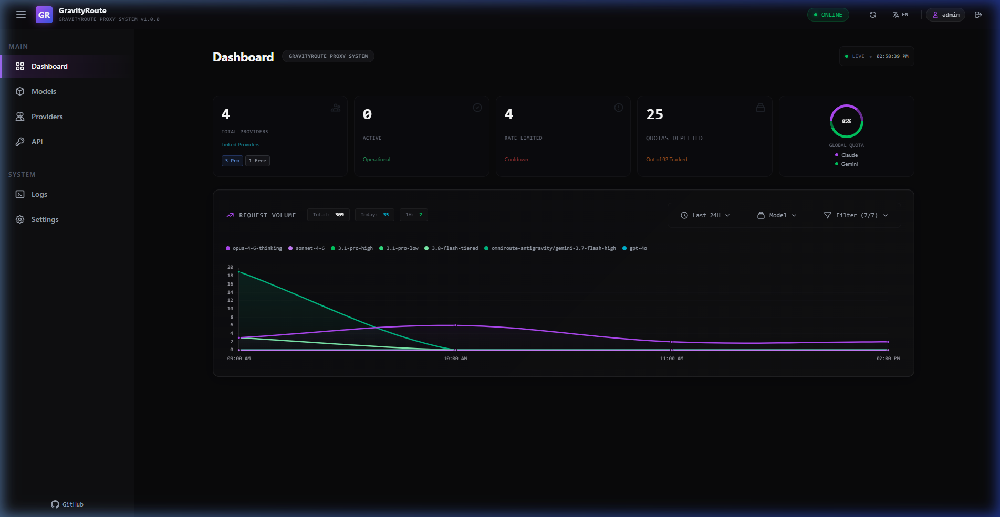

# GravityRoute Web Management Console

**GravityRoute** includes a built-in, modern web interface with a dark glassmorphic aesthetic for real-time monitoring, account pooling, routing configuration, and security management.

Access the console in your browser at:
```
http://localhost:8080
```
*(or your configured `PORT`)*



---

## Key Features

### 1. Real-Time Dashboard & Usage Metrics
- **Live Performance & Quota**: Monitor active accounts, request volume, error rates, model health, and subscription tier distributions (Free, Pro, Ultra).
- **Visual Model Quota**: Track per-model usage and next reset times with color-coded progress bars and draggable threshold indicators.
- **Persistent Historical Trends**: Track request volume and tokens across model families for 30 days, preserved across server restarts.
- **Time Range Filtering**: Filter metrics over 1H, 6H, 24H, 7D, or All Time periods.
- **Live Log Stream**: Stream server logs in real time with level-based filtering (Info, Warn, Error, Debug) and full-text search.

---

### 2. Multi-Account Management & Pooling
- **OAuth Authorization**: Add or remove Google accounts seamlessly.
- **Headless / Remote Server Support**: Add accounts on remote or containerized servers via manual OAuth URL and copy-paste authorization codes.
- **Smart Rotation & Load Balancing**: Support for Hybrid (Smart Distribution), Sticky (Cache-optimized), Round-Robin, and Quota-based account selection.
- **Proactive Quota Protection**: Set global, per-account, or per-model quota thresholds to rotate accounts before rate limits are exhausted.
- **Automated Health & Error Recovery**: Automatically pauses accounts needing captcha/phone verification and provides direct one-click **FIX** links.

---

### 3. WebUI Authentication & Security (`#settings/auth`)
- **Authentication Toggle**: Protect the management console with credentials or allow open local access with a single toggle.
- **Admin Credentials**: Manage administrator username, associated email ID, and password updates with live password strength indicators and current password validation.
- **Session Management**: Secure token-based sessions with optional "Saved Login" persistence and instant server-side session revocation upon logout.
- **Clean Layout**: All authentication controls are centralized in the dedicated **WebUI Auth** tab.

---

### 4. Password Recovery System
GravityRoute features a multi-tiered password recovery mechanism accessible directly from the login screen's **Forgot Password?** modal:

1. **Host Terminal / CLI Command Reset**:
   - Instantly reset admin credentials from the host machine terminal without restarting the server:
     ```bash
     npm run reset-password <new_password> [username]
     # or using the CLI
     gravityroute reset-password <new_password>
     ```
   - Features interactive command generation and 1-click clipboard copy in the recovery dialog.
2. **Admin Email OTP Recovery**:
   - Request a time-limited (15-minute) 6-digit cryptographic verification code delivered to the registered admin email address via SMTP.
   - Built-in rate limiting (max 5 verification attempts with lockout) to prevent brute force.
3. **Independent Mode Control**:
   - Administrators can independently enable or disable CLI reset, email recovery, or both in the **WebUI Auth** settings.

---

### 5. SMTP Mail Server Configuration (`#settings/smtp`)
- **Dedicated SMTP Tab**: Configure outbound email credentials directly from the WebUI.
- **Configuration Fields**: Host, Port (25, 465, 587, 2525), Username, Password, TLS/STARTTLS (`secure` mode), and default Sender Address.
- **Security & Redaction**: Passwords are saved with masking/redaction to prevent exposure.
- **Live SMTP Diagnostics**: Send live test emails directly from the browser to verify mail server connectivity and authentication.

---

### 6. Client Configuration & Presets
- **Claude CLI Tab (`#settings/claude`)**:
  - Switch between **Proxy Mode** and **Paid Mode** (official Anthropic credits).
  - Configure default models, aliases, sub-agent models, and experimental MCP CLI support.
  - One-click "Apply to Claude CLI" writes directly to `~/.claude/settings.json`.
- **Server Presets & Tuning (`#settings/server`)**:
  - Built-in configuration presets for small pools (3-5 accounts), large pools, and custom setups.
  - Tune retry logic, timeout intervals, developer mode, and persistent OAuth sessions.
- **Models Configuration (`#settings/models`)**:
  - Server-side model redirection and alias mapping.
  - Pin favorite models to the top or hide unused models.

---

### 7. Granular API Key Management (`#api-keys`)
- **Proxy Key Generation**: Generate unique `gr-...` API keys for client integrations.
- **Granular Model Access**: Whitelist specific models per API key, preventing unauthorized model usage.
- **Token & Cost Quotas**: Set hard or soft lifetime/monthly token limits per key.
- **IP Address Whitelisting**: Restrict key usage to specific CIDR blocks or IP addresses.
- **Real-Time Usage Telemetry**: View live request counts, token usage, and active status per key.

---

### 8. Custom Providers Integration (`#providers`)
- **OpenAI & Anthropic Compatible**: Register any standard OpenAI or Anthropic compatible upstream provider (e.g., DeepSeek, Groq, Ollama, OpenRouter, Together AI).
- **Custom Model Management**: Define supported model identifiers and display names.
- **Token Quotas & Spend Caps**: Enforce monthly or lifetime spend limits per provider.
- **Interactive Live Testing**: Test endpoint connectivity and response latency directly from the browser.

---

### 9. Account Pool Export & Migration
- **Secure Export**: Export entire configured account pools to encrypted/validated JSON format.
- **Seamless Import**: Migrate accounts between machines or restore backup configurations with schema validation and duplicate detection.

---

### 10. Multi-Language Localization
GravityRoute features a complete localized interface across all views, forms, logs, and dialogs:
- **English** (`en`)
- **বাংলা - Bengali** (`bn`)
- **中文 - Chinese** (`zh`)
- **Türkçe - Turkish** (`tr`)
- **Bahasa Indonesia** (`id`)
- **Português - Brazilian Portuguese** (`pt`)

Switch languages instantly without page reload using the glassmorphic language selector in the top navigation bar or directly on the login card.

